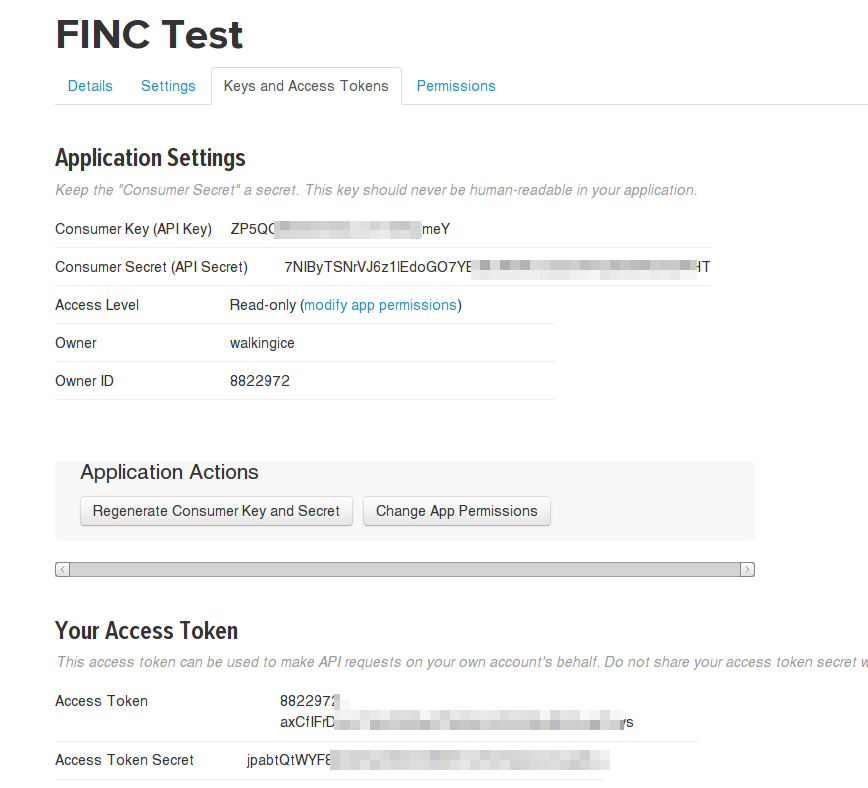

# Introduction


This is a simple app for practice to know how to use these stuffs to access Twitter API.

* Retrofit
* RxJava

If you have any networking problem, you could use **fake data** to see the UI. To use fake data, just open settings and enable corresponding option.

# Build

**This application does not deal with Twitter authentication.** since I want to use as less 3rd-library as possible.

It use [Tokens from dev.twitter.com](https://dev.twitter.com/oauth/overview/application-owner-access-tokens) to fetch authenticated data. And only a developer(REAL MAN) can use it.



1. Go to [Twitter developer manage apps](https://apps.twitter.com/) to create a **twitter-app**.
1. Get these value
    1. Consumer Key
    1. Consumer Secret
    1. Access Token
    1. Access Secret
1. run command

    ```bash
    $ cp gradle.properties.example gradle.properties
    ```

1. Fill values into **gradle.properties.example**

Then open Android Studio to build it.

# Run

* For a built-application, you can also change consumer/access token/secret in Settings.
    * It is painful to enter tokens manually. I STRONGLY suggest to **open browser** to dev.twitter.com **then COPY-Paste**.

* Or, if you just want to see the UI, you can trun on **Fake-data** options. It use local cached json from twitter.

